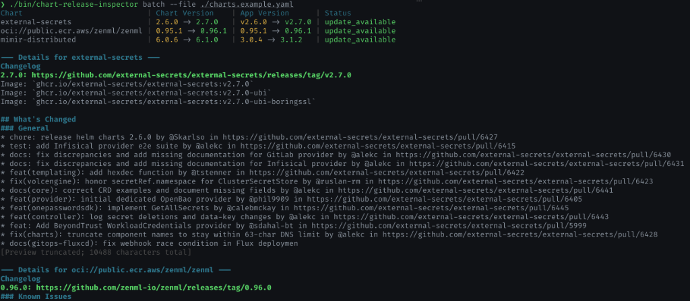

# Chart Release Inspector

[](https://github.com/imtpot/chart-release-inspector/actions/workflows/ci.yml)
[](https://github.com/imtpot/chart-release-inspector/releases)
[](LICENSE)

**Machine-readable upgrade intelligence for Helm charts.**

`chart-release-inspector` gives both human engineers and AI agents everything they need to safely upgrade Helm and OCI charts. It resolves versions, detects application transitions, diffs packaged `values.yaml`, and aggregates upstream GitHub changelogs into a clean terminal report or a stable, structured JSON contract—all **without** contacting your Kubernetes cluster.



---

### The Upgrade Workflow Shift

```
Traditional Workflow (Human):
  Read Notes ──> Compare Values ──> Find Breaking Changes ──> Update ──> Deploy

AI-Agent Workflow (Automated):
  chart-release-inspector ──> Structured JSON ──> Migration Plan ──> PR
```

---

## Why Use It

*   🔒 **Zero-Cluster Access:** Never connects to your Kubernetes cluster or needs credentials.
*   🔍 **Default `values.yaml` Diffing:** Instantly see changes in default values before merging your configuration.
*   📦 **OCI & Classic Helm Support:** A unified interface for classic Helm repositories and `oci://` registries.
*   📝 **Automatic Changelog Mapping:** Automatically retrieves and maps the application's changelog from GitHub releases (supporting various tag naming patterns automatically).
*   🤖 **CI/CD Ready:** Deterministic JSON output and exit codes make it trivial to plug into GitOps pipelines.

---

## AI & Agent Friendly

`chart-release-inspector` is built to be a high-quality, stable structured data provider for LLMs, autonomous coding agents, and GitOps pipelines:

*   **No "AI Inside" Bloat:** The tool does not call LLMs itself. It provides clean, structured, and complete context (version history, value diffs, and changelogs) in a deterministic JSON format, perfect to feed directly into agent prompts.
*   **Predictable Scripting:** Simple semantic exit codes allow agents to make fast branching decisions (e.g., `0` = success, `20` = error; pass `--fail-on-update` to exit `10` on available updates) without parsing raw logs.
*   **Automated PR Summaries:** Run the inspector in CI/CD to let your AI agents automatically analyze upstream Helm changes, highlight key configuration shifts, and write high-quality pull request summaries.

---

## Quick Start

### 1. Install

**Via [mise](https://mise.jdx.dev/):**
```toml
[tools]
"github:imtpot/chart-release-inspector" = "0.7.0"
```

**Via Go:**
```sh
go install github.com/imtpot/chart-release-inspector/cmd/chart-release-inspector@latest
```

**Direct Binary Download:**
Pre-built binaries for Linux, macOS, and Windows are available on the [GitHub Releases](https://github.com/imtpot/chart-release-inspector/releases) page. Download the appropriate binary for your platform and place it in your system `PATH`.

---

### 2. Inspect a Single Chart

```sh
chart-release-inspector inspect \
  --chart external-secrets \
  --repository https://charts.external-secrets.io \
  --version 2.6.0 \
  --values-diff
```

For OCI charts:

```sh
chart-release-inspector inspect \
  --chart oci://ghcr.io/grafana/helm-charts/grafana \
  --version 10.5.14
```

---

### 3. Batch Checks

Audit multiple charts at once using a YAML manifest (see [`charts.example.yaml`](charts.example.yaml)):

```sh
chart-release-inspector batch --file charts.example.yaml
```

#### Manifest Schema

```yaml
charts:
  # Standard Helm chart (changelog resolved automatically from chart metadata)
  - chart: external-secrets
    repository: https://charts.external-secrets.io
    version: 2.6.0
    target_version: 2.7.0

  # OCI chart (changelog resolved automatically from registry metadata)
  - chart: oci://public.ecr.aws/zenml/zenml
    version: 0.95.1
    target_version: 0.96.1

  # Custom application repository override (useful for monorepos)
  - chart: mimir-distributed
    repository: https://grafana.github.io/helm-charts
    version: 6.0.6
    target_version: 6.1.0
    app_repository: https://github.com/grafana/mimir
```

---

## Automation Contract

Use `--output json` and exit codes to integrate with GitOps pipelines:

| Exit Code | Meaning |
| :---: | :--- |
| **`0`** | Completed successfully (current or update available). |
| **`10`** | Updates available (only when running with `--fail-on-update`). |
| **`20`** | Upstream lookup or validation failed. |

```sh
chart-release-inspector batch --file charts.example.yaml --output json > report.json
```

To avoid rate limits on GitHub, set `GITHUB_TOKEN` in your environment.

---

## Contributing

Contributions that improve chart compatibility, changelog conventions, and automation integration are welcome.

```sh
go test ./...
go vet ./...
go build ./cmd/chart-release-inspector
```

---

## License

Licensed under the [Apache License 2.0](LICENSE).
